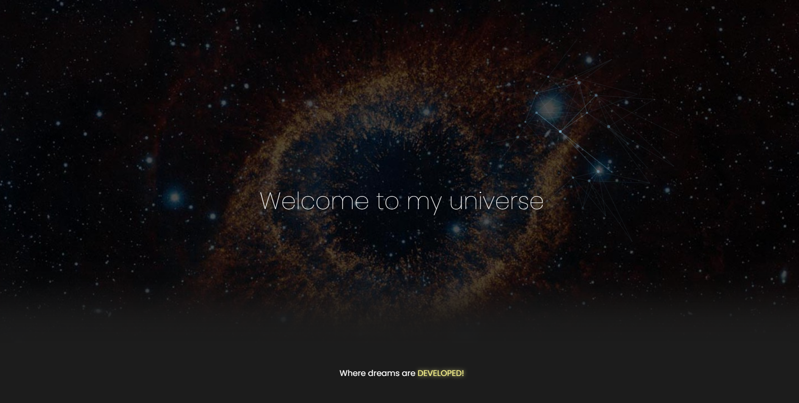

# 🌐 My Web Portfolio

Welcome to the repository of my web portfolio! 🚀 Here I showcase who I am and the projects that bring my ideas to life. 🎨

## 🚀 Technologies Used

This project was developed using the following technologies:
- **React** ⚛️
- **TypeScript** 🟦
- **JavaScript** ✨
- **HTML** 🏗️
- **CSS** 🎨
- **Tailwind CSS** 💨

## 📌 Features
- Display of personal and professional information
- Section for developed projects
- Responsive and modern layout

## 📦 How to Run the Project

1. Clone this repository:
   ```sh
   git clone https://github.com/yourusername/repository-name.git
   ```

2. Navigate to the project folder:
   ```sh
   cd repository-name
   ```

3. Install dependencies:
   ```sh
   npm install
   ```
   or
   ```sh
   yarn install
   ```

4. Start the development server:
   ```sh
   npm run dev
   ```
   or
   ```sh
   yarn dev
   ```

5. Open in your browser:
   ```
   http://localhost:5173
   ```

## 🎨 Demo and Figma

Access the project in **figma** by clicking here: [Web Portfolio - Figma Project](https://www.figma.com/design/l91F37ZeInst77zcQAWXu0/Web-Portfolio?node-id=0-1&t=ZYIAeuhXpwDAm69t-1)

## 📜 License
This project is licensed under the MIT License - feel free to use and improve it! 😊

---

Made with ❤️ by [VitorLougon](https://github.com/LougonVitor)
